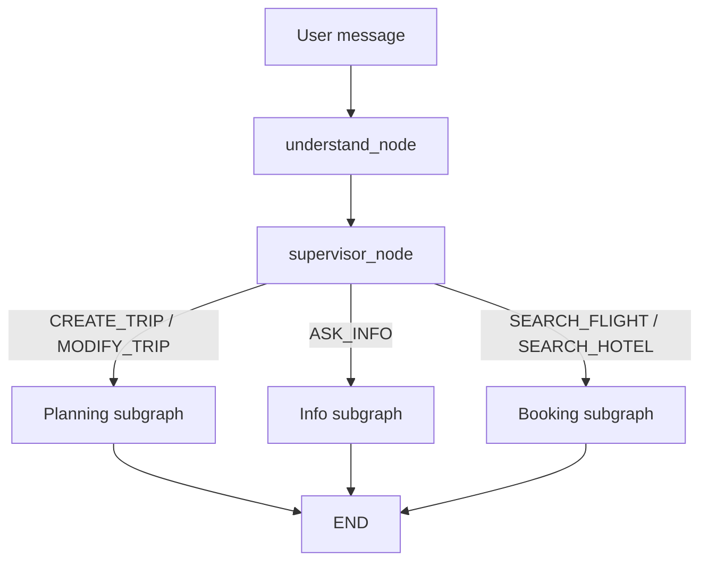

# Agent Deep Dive - AI Travel Assistant

Tai lieu nay chi tap trung vao **phan Agentic AI**, vi day la loi cua project. Muc tieu la giup m giai thich duoc:

- Agent duoc goi tu dau.
- Luong chay tong the cua LangGraph.
- Moi node/subgraph lam gi.
- Du lieu duoc truyen qua state nhu the nao.
- LLM duoc dung o dau, tools duoc dung o dau.
- Vi sao thiet ke nhu vay.
- Neu thay hoi phan bien thi tra loi ra sao.

---

## Table Of Contents

1. [Agent La Gi Trong Project Nay](#1-agent-la-gi-trong-project-nay)
2. [Vi Tri Cua Agent Trong Kien Truc Tong The](#2-vi-tri-cua-agent-trong-kien-truc-tong-the)
3. [Cac File Lien Quan Den Agent](#3-cac-file-lien-quan-den-agent)
4. [Hai Cach Goi Agent: REST Va WebSocket](#4-hai-cach-goi-agent-rest-va-websocket)
5. [Luong Tong The Cua LangGraph](#5-luong-tong-the-cua-langgraph)
6. [AgentState: Hop Den Chua Toan Bo Ngu Canh](#6-agentstate-hop-den-chua-toan-bo-ngu-canh)
7. [graph.py: Build Graph Va Chay Agent](#7-graphpy-build-graph-va-chay-agent)
8. [Understand Node: Bien Ngon Ngu Tu Nhien Thanh Intent/Entities](#8-understand-node-bien-ngon-ngu-tu-nhien-thanh-intententities)
9. [Supervisor Subgraph: Dieu Phoi Sang Agent Con](#9-supervisor-subgraph-dieu-phoi-sang-agent-con)
10. [Planning Subgraph: Xu Ly Tao/Sua Lich Trinh](#10-planning-subgraph-xu-ly-taosua-lich-trinh)
11. [Retrieve Node: Lay DB Context Va Memory](#11-retrieve-node-lay-db-context-va-memory)
12. [Search Node: Tavily Search Va GDS Offers](#12-search-node-tavily-search-va-gds-offers)
13. [Weather Node: Dua Thoi Tiet Vao Ke Hoach](#13-weather-node-dua-thoi-tiet-vao-ke-hoach)
14. [Plan Node: Prompt Lon De Sinh Trip/Itinerary JSON](#14-plan-node-prompt-lon-de-sinh-tripitinerary-json)
15. [Constraint Node: Validation Sau LLM](#15-constraint-node-validation-sau-llm)
16. [Finalize Node: Persist Ket Qua AI Vao Database](#16-finalize-node-persist-ket-qua-ai-vao-database)
17. [Info Subgraph: Hoi Dap Thong Tin Du Lich](#17-info-subgraph-hoi-dap-thong-tin-du-lich)
18. [Booking Subgraph: Search Flight/Hotel](#18-booking-subgraph-search-flighthotel)
19. [Tools Layer: TavilySearchTool Va MockSearchTool](#19-tools-layer-tavilysearchtool-va-mocksearchtool)
20. [Memory/RAG Voi pgvector](#20-memoryrag-voi-pgvector)
21. [External Services Duoc Agent Dung](#21-external-services-duoc-agent-dung)
22. [So Sanh CREATE_TRIP, MODIFY_TRIP, ASK_INFO, SEARCH_FLIGHT, SEARCH_HOTEL](#22-so-sanh-create_trip-modify_trip-ask_info-search_flight-search_hotel)
23. [Vi Sao Day La Agentic AI, Khong Phai Chatbot Thuong](#23-vi-sao-day-la-agentic-ai-khong-phai-chatbot-thuong)
24. [Cac Diem Manh Cua Thiet Ke Agent](#24-cac-diem-manh-cua-thiet-ke-agent)
25. [Cac Diem Yeu/Rui Ro Va Cach Tra Loi](#25-cac-diem-yeurui-ro-va-cach-tra-loi)
26. [Cau Hoi Phan Bien Ve Agent Va Cach Tra Loi](#26-cau-hoi-phan-bien-ve-agent-va-cach-tra-loi)
27. [Kich Ban Demo Agent Nen Trinh Bay](#27-kich-ban-demo-agent-nen-trinh-bay)
28. [Ban Noi 5 Phut Ve Agent](#28-ban-noi-5-phut-ve-agent)

---

## 1. Agent La Gi Trong Project Nay

Trong project nay, "agent" khong chi la mot ham goi OpenAI de tra loi text. Agent la mot **workflow AI co trang thai**, co nhieu buoc xu ly:

```text
User message
-> hieu y dinh
-> chon loai tac vu
-> lay ngu canh tu database/memory
-> tim thong tin ngoai
-> lay thoi tiet/booking inventory
-> sinh ke hoach co cau truc
-> kiem tra rang buoc
-> luu database
-> tra ket qua cho frontend
```

Noi cach khac, agent trong project nay co 3 diem:

1. **Reasoning/coordinator**: biet phan loai user dang muon tao trip, sua trip, hoi thong tin, tim flight hay tim hotel.
2. **Tool-using**: biet lay search results, weather, memory, flight/hotel offers.
3. **Action-taking**: khong chi tra loi, ma tao/sua Trip va Itinerary trong database.

Khi bao ve, co the noi:

> Agent trong he thong cua em la mot workflow LangGraph co nhieu node. Moi node phu trach mot buoc rieng: understand, route, retrieve, search, weather, plan, constraint va finalize. Vi vay AI khong chi sinh text ma co the tao du lieu lich trinh that trong database.

---

## 2. Vi Tri Cua Agent Trong Kien Truc Tong The

Agent nam o backend:

```text
frontend
  |
  | REST / WebSocket
  v
backend routes
  |
  | run_agent / run_agent_streaming
  v
backend/app/agents
  |
  +-- OpenAI LLM
  +-- Tavily search
  +-- WeatherAPI
  +-- Travelport / Booking.com
  +-- PostgreSQL / pgvector memory
```

Agent khong duoc frontend goi truc tiep. Frontend chi goi backend:

- Tao/sua trip bang REST: `POST /trips/generate`.
- Chat realtime bang WebSocket: `/ai/chat-stream`.

Backend route se authenticate user truoc, sau do moi goi agent.

Ly do:

- API key OpenAI/Tavily/Weather khong lo ra frontend.
- Backend kiem soat permission user.
- Backend moi co DB session de retrieve/persist.
- Agent output phai duoc map vao domain models.

---

## 3. Cac File Lien Quan Den Agent

### 3.1. Entry points

```text
backend/app/routes/trips.py
backend/app/routes/ai_chat.py
backend/app/agents/graph.py
```

- `trips.py`: endpoint REST `/trips/generate`, goi `run_agent`.
- `ai_chat.py`: endpoint WebSocket `/ai/chat-stream`, goi `run_agent_streaming`.
- `graph.py`: build LangGraph va expose 2 ham chay agent.

### 3.2. State va tools

```text
backend/app/agents/state.py
backend/app/agents/tools.py
```

- `state.py`: dinh nghia `AgentState`, la object duoc truyen qua toan bo graph.
- `tools.py`: dinh nghia search tool, gom Tavily va Mock fallback.

### 3.3. Nodes

```text
backend/app/agents/nodes/understand.py
backend/app/agents/nodes/retrieve.py
backend/app/agents/nodes/search.py
backend/app/agents/nodes/weather.py
backend/app/agents/nodes/plan.py
backend/app/agents/nodes/constraint.py
backend/app/agents/nodes/finalize.py
backend/app/agents/nodes/answer.py
backend/app/agents/nodes/decision.py
```

Moi node la mot buoc xu ly.

- `understand.py`: phan loai intent va extract entities.
- `retrieve.py`: lay user profile, existing trip, itinerary, memory.
- `search.py`: goi Tavily/search va lay GDS offers.
- `weather.py`: lay weather context.
- `plan.py`: goi LLM sinh trip/itinerary JSON.
- `constraint.py`: kiem tra time overlap va budget.
- `finalize.py`: luu trip/itinerary/memory vao DB.
- `answer.py`: sinh cau tra loi cho ASK_INFO.
- `decision.py`: file du phong/cu. Luong graph hien tai routing bang supervisor, khong thay import `decision.py` trong `graph.py`.

### 3.4. Subgraphs

```text
backend/app/agents/subgraphs/supervisor.py
backend/app/agents/subgraphs/planning.py
backend/app/agents/subgraphs/info.py
backend/app/agents/subgraphs/booking.py
```

- `supervisor.py`: route theo intent.
- `planning.py`: xu ly CREATE_TRIP/MODIFY_TRIP.
- `info.py`: xu ly ASK_INFO.
- `booking.py`: xu ly SEARCH_FLIGHT/SEARCH_HOTEL.

### 3.5. Services ma agent goi

```text
backend/app/services/memory_service.py
backend/app/services/trip_service.py
backend/app/services/weather_service.py
backend/app/services/travelport_service.py
backend/app/services/booking_com_service.py
```

- `memory_service.py`: embedding va vector search.
- `trip_service.py`: tao/sua/xoa trip, itinerary.
- `weather_service.py`: lay du bao thoi tiet.
- `travelport_service.py`: search flight/hotel va booking simulation.
- `booking_com_service.py`: search hotels Booking.com/RapidAPI va booking simulation.

---

## 4. Hai Cach Goi Agent: REST Va WebSocket

Agent co 2 public runtime paths.

### 4.1. REST path: tao trip hoac sua trip khong streaming

File: `backend/app/routes/trips.py`

Endpoint:

```python
@router.post("/generate")
async def generate_trip(...)
```

Luong:

```text
Frontend Dashboard / GuidedPlanner
-> POST /trips/generate
-> get_current_user
-> optional permission check neu co trip_id
-> run_agent(...)
-> return result
```

Code goi agent:

```python
result = await run_agent(
    user_message=message,
    user_id=current_user.id,
    trip_id=trip_id,
    session=session,
)
```

Khi dung:

- User tao trip moi tu dashboard.
- User tao trip tu guided form.
- Co the sua trip bang REST neu frontend goi `generateTrip(message, tripId)`.

Dac diem:

- Client doi den khi agent chay xong.
- Response tra ve day du trip/itinerary/messages.

### 4.2. WebSocket path: chat AI realtime

File: `backend/app/routes/ai_chat.py`

Endpoint:

```python
@router.websocket("/chat-stream")
async def chat_stream(websocket: WebSocket, token: str = Query(...)):
```

Luong:

```text
Frontend ChatInterface
-> connect /ai/chat-stream?token=JWT
-> backend decode token
-> receive {message, trip_id}
-> run_agent_streaming(...)
-> send token/progress chunks
-> send final message
-> broadcast REFRESH_ITINERARY neu co trip_id
```

Code goi agent:

```python
async for chunk in run_agent_streaming(
    user_message=message,
    user_id=user_id,
    trip_id=trip_id,
    session=session,
):
    await _send(websocket, chunk)
```

Khi dung:

- User dang o trip detail va chat voi AI de sua lich trinh.
- User hoi thong tin du lich trong context trip.
- User tim flight/hotel qua chat.

Dac diem:

- Co progress realtime.
- Khong can doi full response moi hien thi.
- Sau khi agent xong, itinerary duoc broadcast refresh.

### 4.3. Vi sao can ca REST va WebSocket?

REST phu hop khi:

- Tao trip tu form.
- Client chi can ket qua cuoi.
- De debug qua Swagger/Postman.

WebSocket phu hop khi:

- Tac vu AI lau.
- Can hien progress.
- Chat lien tuc trong cung connection.
- Can realtime sync sau khi sua trip.

Cach noi khi bao ve:

> Em tach REST va WebSocket theo trai nghiem nguoi dung. Tao trip tu dashboard dung REST vi chi can ket qua cuoi de redirect. Chat AI trong trip detail dung WebSocket de stream tien trinh xu ly va refresh itinerary realtime.

---

## 5. Luong Tong The Cua LangGraph

File: `backend/app/agents/graph.py`

Comment dau file mo ta:

```text
understand -> supervisor -> [planning | info | booking]
```

Day la graph cap cao.



### 5.1. Intent quyet dinh duong di

Understand node sinh `intent`:

- `CREATE_TRIP`
- `MODIFY_TRIP`
- `ASK_INFO`
- `SEARCH_FLIGHT`
- `SEARCH_HOTEL`

Supervisor map intent sang `agent_type`:

```text
CREATE_TRIP / MODIFY_TRIP -> planning
ASK_INFO                  -> info
SEARCH_FLIGHT/HOTEL      -> booking
```

### 5.2. Planning subgraph

Cho tao/sua lich trinh:

```text
planning_entry
  -> search hoac retrieve
  -> weather_context
  -> plan
  -> constraint
  -> finalize
```

### 5.3. Info subgraph

Cho hoi dap:

```text
search -> answer -> finalize
```

### 5.4. Booking subgraph

Cho tim flight/hotel:

```text
booking_search -> booking_finalize
```

### 5.5. Diem can nhan manh

LangGraph giup workflow ro rang:

- Node nao goi LLM.
- Node nao goi DB.
- Node nao goi API ngoai.
- Node nao validate.
- Node nao persist.

Tra loi phan bien:

> Em dung LangGraph vi agent cua em co nhieu duong di va nhieu buoc khac nhau. Graph giup moi buoc tach rieng, co state chung, co conditional routing va de mo rong them sub-agent moi.

---

## 6. AgentState: Hop Den Chua Toan Bo Ngu Canh

File: `backend/app/agents/state.py`

`AgentState` la `TypedDict`. No la object duoc truyen tu node nay sang node khac.

### 6.1. Nhom input

```python
user_message: str
user_id: int
trip_id: Optional[int]
```

- `user_message`: cau user nhap.
- `user_id`: lay tu JWT/current user.
- `trip_id`: co neu dang sua/hoi trong trip hien co.

### 6.2. Nhom understand output

```python
intent: str
entities: dict
```

Vi du user message:

```text
Plan a 3-day trip to Da Nang from Hanoi, budget 8 million VND
```

Co the duoc parse thanh:

```json
{
  "intent": "CREATE_TRIP",
  "entities": {
    "location": "Da Nang",
    "start_date": null,
    "end_date": null,
    "num_days": 3,
    "budget": 8000000,
    "currency": "VND",
    "origin_airport": "HAN",
    "destination_airport": "DAD",
    "adults": 1
  }
}
```

### 6.3. Nhom retrieved context

```python
existing_trip: Optional[dict]
user_profile: Optional[dict]
memory_context: list[str]
search_results: list[dict]
```

- `existing_trip`: dung khi MODIFY_TRIP.
- `user_profile`: preferences tu user profile.
- `memory_context`: memory retrieve tu pgvector.
- `search_results`: ket qua Tavily/search.

### 6.4. Nhom generated plan

```python
trip_data: Optional[dict]
itinerary_items: list[dict]
```

LLM trong `plan_node` sinh ra 2 field nay.

### 6.5. Nhom validation/final output

```python
conflicts: list[dict]
messages: list[dict]
```

- `conflicts`: time overlap, budget exceeded.
- `messages`: cau tra loi cuoi cho frontend.

### 6.6. Nhom routing

```python
next_node: str
agent_type: str
```

`agent_type` la field quan trong do supervisor set.

### 6.7. Nhom booking/weather

```python
booking_params: dict
booking_results: list
gds_offers: dict
weather_context: dict
```

- `booking_params`: search flight/hotel direct.
- `booking_results`: ket qua booking agent tra ve.
- `gds_offers`: inventory dua vao planning prompt.
- `weather_context`: tom tat thoi tiet dua vao planning prompt.

### 6.8. Luu y nho ve bug/diem can noi

Trong `state.py` co khai bao `gds_offers`, nhung `_make_initial_state()` trong `graph.py` hien tai chua khoi tao `gds_offers`. Code van khong crash vi `plan_node` dung:

```python
gds_offers = state.get("gds_offers") or {"flights": [], "hotels": []}
```

Neu bi hoi:

> State co field `gds_offers`; trong initial state co the bo sung gia tri mac dinh de ro rang hon. Hien tai code van safe vi khi doc field co fallback empty flights/hotels.

---

## 7. graph.py: Build Graph Va Chay Agent

File: `backend/app/agents/graph.py`

### 7.1. build_graph(session)

```python
def build_graph(session: AsyncSession) -> StateGraph:
    planning = build_planning_graph(session).compile()
    info = build_info_graph(session).compile()
    booking = build_booking_graph().compile()
```

Graph tong compile cac subgraph:

- planning can `session` vi retrieve/finalize dung DB.
- info can `session` vi finalize can session.
- booking khong can session vi chi search external/simulated results.

Sau do:

```python
graph = StateGraph(AgentState)
```

Tao graph voi state schema la `AgentState`.

Add nodes:

```python
graph.add_node("understand", understand_node)
graph.add_node("supervisor", supervisor_node)
graph.add_node("planning", planning)
graph.add_node("info", info)
graph.add_node("booking", booking)
```

Set entry:

```python
graph.set_entry_point("understand")
```

Canh co dieu kien:

```python
graph.add_conditional_edges(
    "supervisor",
    route_after_supervisor,
    {"planning": "planning", "info": "info", "booking": "booking"},
)
```

Y nghia:

- Sau supervisor, goi `route_after_supervisor(state)`.
- Neu return `"planning"` thi di planning node.
- Neu return `"info"` thi di info node.
- Neu return `"booking"` thi di booking node.

### 7.2. run_agent()

```python
async def run_agent(...):
    graph = build_graph(session)
    compiled = graph.compile()
    initial_state = _make_initial_state(...)
    final_state = await compiled.ainvoke(initial_state)
```

`ainvoke` chay graph den END va tra state cuoi.

Return ve frontend:

```python
{
    "action": final_state.get("intent") or "ASK_INFO",
    "trip": final_state.get("trip_data"),
    "itinerary_items": final_state.get("itinerary_items") or [],
    "conflicts": final_state.get("conflicts") or [],
    "messages": final_state.get("messages") or [],
    "booking_results": final_state.get("booking_results") or [],
}
```

Day la response cua REST `/trips/generate`.

### 7.3. run_agent_streaming()

```python
async for event in compiled.astream(initial_state):
```

`astream` tra event khi node/subgraph co output. Code convert event thanh message WebSocket.

Neu node `understand` xong:

```json
{
  "type": "token",
  "content": "Understanding your request...",
  "metadata": {"node": "understand"}
}
```

Neu supervisor chon planning:

```json
{
  "type": "token",
  "content": "Creating your personalized itinerary...",
  "metadata": {"node": "planning"}
}
```

Neu planning/info/booking xong:

```json
{
  "type": "final",
  "content": "...",
  "metadata": {
    "action": "...",
    "trip": {...},
    "itinerary_items": [...],
    "conflicts": [...],
    "booking_results": [...]
  }
}
```

### 7.4. Diem quan trong khi giai thich streaming

Trong code hien tai, "token" la progress chunk theo node, khong phai token-by-token raw OpenAI stream.

Cach noi an toan:

> He thong stream tien trinh xu ly cua agent theo node qua WebSocket. Moi khi agent qua mot moc quan trong nhu understand, supervisor hoac final subgraph, backend gui mot chunk ve frontend. Neu can nang cap, co the thay bang token streaming truc tiep tu LLM.

### 7.5. _make_initial_state()

Khoi tao tat ca field ve gia tri rong:

```python
"intent": "",
"entities": {},
"existing_trip": None,
"memory_context": [],
"search_results": [],
"trip_data": None,
"itinerary_items": [],
"conflicts": [],
"messages": [],
"agent_type": "",
"booking_params": {},
"booking_results": [],
"weather_context": {},
```

Muc dich:

- Node sau co field de doc.
- Tranh KeyError o cac buoc co fallback.

---

## 8. Understand Node: Bien Ngon Ngu Tu Nhien Thanh Intent/Entities

File: `backend/app/agents/nodes/understand.py`

### 8.1. Muc tieu

Understand node tra loi 2 cau hoi:

1. User dang muon lam gi?
2. Trong cau user co thong tin cau truc nao?

Vi du:

```text
Tim ve may bay tu Ha Noi di Da Nang ngay 20/7 cho 2 nguoi
```

Can ra:

```json
{
  "intent": "SEARCH_FLIGHT",
  "entities": {
    "origin_airport": "HAN",
    "destination_airport": "DAD",
    "start_date": "2026-07-20",
    "adults": 2
  }
}
```

### 8.2. LLM setup

```python
llm = ChatOpenAI(
    model=settings.OPENAI_MODEL,
    api_key=settings.OPENAI_API_KEY,
    temperature=0
)
```

`temperature=0` vi day la task phan loai/trich xuat, can on dinh hon sang tao.

### 8.3. Prompt

Prompt co rules:

- Neu co destination va muon travel/plan/go there -> CREATE_TRIP.
- Neu change/update/modify existing plan -> MODIFY_TRIP.
- Neu chi hoi thong tin -> ASK_INFO.
- Neu tim flights -> SEARCH_FLIGHT.
- Neu tim hotels/accommodation -> SEARCH_HOTEL.
- Short messages nhu "du lich Ha Noi" -> CREATE_TRIP.
- Khi phan van CREATE_TRIP vs ASK_INFO -> prefer CREATE_TRIP.

Day la mot rule quan trong. No lam app chu dong tao trip neu user noi ngan gon.

### 8.4. Current date

```python
from datetime import date
current_date=date.today().isoformat()
```

Prompt dua current date vao de LLM resolve relative dates.

### 8.5. JSON-only contract

Prompt yeu cau:

```text
Return ONLY valid JSON, no explanation, no markdown.
```

Ly do:

- Code can `json.loads`.
- Output co cau truc thi cac node sau moi dung duoc.

### 8.6. Parse va fallback

Code strip markdown fence:

```python
if content.startswith("```"):
    content = content.split("```")[1]
    if content.startswith("json"):
        content = content[4:]
```

Neu JSON parse loi:

```python
parsed = {
    "intent": "CREATE_TRIP",
    "entities": {
        "location": state["user_message"],
        "num_days": 3,
        "preferences": [],
        "constraints": []
    },
}
```

Y nghia:

- Neu LLM output sai format, app van co duong fallback.
- Fallback uu tien CREATE_TRIP de user khong bi fail ngay.

### 8.7. Default num_days

```python
if not state["entities"].get("num_days"):
    state["entities"]["num_days"] = 3
```

Neu user khong noi so ngay, mac dinh 3 ngay.

### 8.8. Build booking_params

Neu intent la booking:

```python
state["booking_params"] = {
    "origin": entities.get("origin_airport"),
    "destination": entities.get("destination_airport"),
    "departure_date": entities.get("start_date"),
    "return_date": entities.get("end_date"),
    "city_code": entities.get("city_code") or entities.get("destination_airport"),
    "checkin": entities.get("checkin") or entities.get("start_date"),
    "checkout": entities.get("checkout") or entities.get("end_date"),
    "adults": entities.get("adults") or 1,
}
```

Booking subgraph khong can doc raw entities nua, chi doc `booking_params`.

### 8.9. Cau hoi phan bien

**Hoi:** Vi sao phai co understand node, sao khong dua thang prompt vao plan node?

**Tra loi:**

> Understand node bien ngon ngu tu nhien thanh intent va entities co cau truc. Nho vay he thong biet user can tao trip, sua trip, hoi thong tin hay tim booking. Neu dua thang vao plan node, moi yeu cau deu bi xu ly nhu lap lich, de sai hanh vi va kho mo rong.

---

## 9. Supervisor Subgraph: Dieu Phoi Sang Agent Con

File: `backend/app/agents/subgraphs/supervisor.py`

### 9.1. supervisor_node

```python
def supervisor_node(state: AgentState) -> AgentState:
    intent = state.get("intent", "ASK_INFO")

    if intent in ("CREATE_TRIP", "MODIFY_TRIP"):
        state["agent_type"] = "planning"
    elif intent in ("SEARCH_FLIGHT", "SEARCH_HOTEL"):
        state["agent_type"] = "booking"
    else:
        state["agent_type"] = "info"

    return state
```

Supervisor khong goi LLM. No la rule-based router.

### 9.2. route_after_supervisor

```python
def route_after_supervisor(state: AgentState) -> str:
    return state.get("agent_type", "info")
```

LangGraph dung ham nay de chon edge.

### 9.3. Vi sao supervisor rule-based?

Vi `understand_node` da dung LLM de phan loai intent. Supervisor chi can map intent sang subgraph.

Loi ich:

- Don gian.
- De debug.
- It ton token.
- Deterministic.

### 9.4. Neu muon mo rong?

Co the them:

```text
VISA_INFO -> visa agent
BUDGET_OPTIMIZE -> budget agent
EMERGENCY_HELP -> safety agent
```

Chi can:

1. Them intent vao understand prompt.
2. Them mapping trong supervisor.
3. Build subgraph moi.
4. Them node/edge trong `graph.py`.

---

## 10. Planning Subgraph: Xu Ly Tao/Sua Lich Trinh

File: `backend/app/agents/subgraphs/planning.py`

Planning la subgraph quan trong nhat.

### 10.1. Build nodes

```python
graph.add_node("planning_entry", planning_entry_node)
graph.add_node("retrieve", _retrieve)
graph.add_node("search", search_node)
graph.add_node("weather_context", weather_context_node)
graph.add_node("plan", plan_node)
graph.add_node("constraint", constraint_node)
graph.add_node("finalize", _finalize)
```

`retrieve` va `finalize` can DB session, nen dung `functools.partial`:

```python
_retrieve = functools.partial(retrieve_node, session=session)
_finalize = functools.partial(finalize_node, session=session)
```

### 10.2. Entry routing

```python
def route_planning_entry(state: AgentState) -> str:
    return "search" if state.get("intent") == "CREATE_TRIP" else "retrieve"
```

Neu CREATE_TRIP:

```text
planning_entry -> search -> weather_context -> plan -> constraint -> finalize
```

Neu MODIFY_TRIP:

```text
planning_entry -> retrieve -> weather_context -> plan -> constraint -> finalize
```

### 10.3. Nhan xet quan trong ve MODIFY_TRIP

Hien tai MODIFY_TRIP di `retrieve -> weather -> plan`, khong di qua `search`.

Dieu nay co nghia:

- Khi sua trip, agent uu tien existing itinerary + memory.
- Neu user sua dua tren thong tin moi ngoai internet, search moi co the khong duoc goi.

Neu bi hoi:

> Hien tai modify flow tap trung bao toan lich trinh cu va sua theo context da co. Neu can grounding moi khi modify, co the them edge `retrieve -> search -> weather_context` de search bo sung truoc khi plan.

### 10.4. Vi sao co constraint truoc finalize?

LLM co the sinh lich trung gio hoac vuot budget. Constraint node la validation rule-based truoc khi luu.

### 10.5. Vi sao finalize la node cuoi?

De dam bao:

- Chi sau khi da co plan va conflicts moi luu.
- Mapping DB nam mot noi.
- LLM khong thao tac DB truc tiep.

---

## 11. Retrieve Node: Lay DB Context Va Memory

File: `backend/app/agents/nodes/retrieve.py`

### 11.1. Muc tieu

Retrieve node dua du lieu san co vao agent:

- User profile.
- Existing trip.
- Existing itinerary.
- Memory context.

Dung nhieu nhat trong MODIFY_TRIP.

### 11.2. Lay user profile

```python
user_result = await session.execute(select(User).where(User.id == user_id))
user = user_result.scalar_one_or_none()
if user and user.travel_profile:
    state["user_profile"] = user.travel_profile
```

`travel_profile` la JSON luu so thich nguoi dung.

Vi du:

```json
{
  "interests": ["food", "culture"],
  "pace": "relaxed",
  "budget_level": "standard"
}
```

### 11.3. Lay existing trip va itinerary

Neu co `trip_id`:

```python
trip_result = await session.execute(
    select(Trip).where(Trip.id == trip_id, Trip.user_id == user_id)
)
```

Luu y: doan nay chi query trip owner (`Trip.user_id == user_id`). Trong route truoc do da check permission bang `TripService.get_trip`, nhung trong retrieve node neu user la collaborator thi co the khong lay duoc existing_trip.

Neu bi hoi:

> Route da check collaborator permission truoc khi goi agent. Tuy nhien retrieve node hien query owner truc tiep. De ho tro collaborator modify day du hon, nen thay bang `TripService.get_trip` hoac join collaborator trong retrieve node.

### 11.4. Lay itinerary items

```python
items_result = await session.execute(
    select(ItineraryItem)
    .where(ItineraryItem.trip_id == trip_id)
    .order_by(ItineraryItem.day_number, ItineraryItem.start_time)
)
```

Sau do:

```python
state["itinerary_items"] = [i.model_dump() for i in items]
```

Plan node dua existing itinerary vao prompt de LLM preserve nhung item khong bi yeu cau thay doi.

### 11.5. Retrieve memory

```python
memories = await retrieve_memory(session, user_id, query, top_k=5, trip_id=trip_id)
state["memory_context"] = [m.content for m, _ in memories]
```

Memory context dua vao prompt planning.

### 11.6. Cau hoi phan bien

**Hoi:** Retrieve node khac search node the nao?

**Tra loi:**

> Retrieve node lay du lieu noi bo cua he thong: user profile, trip hien co, itinerary hien co va memory trong database. Search node lay thong tin ben ngoai nhu attractions/restaurants hoac booking offers. Mot cai la internal context, mot cai la external grounding.

---

## 12. Search Node: Tavily Search Va GDS Offers

File: `backend/app/agents/nodes/search.py`

### 12.1. Muc tieu

Search node lam 2 viec:

1. Lay thong tin du lich ben ngoai qua search tool.
2. Lay flight/hotel offers de dua vao planning prompt.

### 12.2. Extract trip context

Ham `_extract_trip_context` doc:

- `existing_trip.destination`.
- lodging item dau tien de lay hotel name/address.

Muc dich:

Neu user hoi:

```text
Co quan mi quang nao gan khach san khong?
```

Agent co hotel context de search:

```text
quan mi quang near Muong Thanh Da Nang
```

### 12.3. Build query cho ASK_INFO

Neu co hotel + destination:

```python
queries.append(f"{user_message[:150]} near {hotel} {destination}")
queries.append(f"{user_message[:100]} in {destination}")
```

Neu chi co destination:

```python
queries.append(f"{user_message[:150]} in {destination}")
```

Neu khong co context:

```python
queries.append(user_message[:200])
```

### 12.4. Build query cho CREATE/MODIFY

Neu co destination:

```python
queries.append(f"top tourist attractions things to do in {destination}")
queries.append(f"best restaurants food in {destination}")
```

Search results duoc cat top 10:

```python
state["search_results"] = all_results[:10]
```

### 12.5. Search tool fallback

Search tool lay tu:

```python
tool = get_search_tool()
```

Neu Tavily key co -> Tavily.

Neu khong -> MockSearchTool.

Day la fallback de demo khong crash.

### 12.6. GDS offers

Neu intent la CREATE/MODIFY va co destination:

```python
travelport = TravelportClient()
booking_com = BookingComClient()
```

Lay:

- `flight_offers`.
- `hotel_offers`.

Gan:

```python
state["gds_offers"] = {
    "flights": flight_offers,
    "hotels": hotel_offers
}
```

### 12.7. Mapping airport

Search node co helper mapping location -> airport:

- Hanoi -> HAN.
- Ho Chi Minh/Saigon -> SGN.
- Da Nang -> DAD.
- Nha Trang -> CXR.
- Phu Quoc -> PQC.
- Da Lat -> DLI.
- Hue -> HUI.
- Hai Phong -> HPH.

Day la heuristic phuc vu demo Viet Nam/local routes.

### 12.8. Fallback khi search/API loi

Neu tool.search loi:

```python
all_results.append({
    "type": "placeholder",
    "message": f"Không tìm thấy thông tin ({str(e)})",
    "query": q,
})
```

Neu GDS loi:

```python
state["gds_offers"] = {"flights": [], "hotels": []}
```

### 12.9. Cau hoi phan bien

**Hoi:** LLM da co kien thuc san, sao can search?

**Tra loi:**

> Kien thuc LLM co the cu hoac bi hallucination. Search node giup grounding vao thong tin thuc te hon ve attractions, nha hang, dia diem. Ngoai ra GDS offers giup lich trinh co flight/hotel options cu the thay vi ten dich vu tuong tuong.

---

## 13. Weather Node: Dua Thoi Tiet Vao Ke Hoach

File:

- `backend/app/agents/nodes/weather.py`
- `backend/app/services/weather_service.py`

### 13.1. Muc tieu

Weather node lay forecast cho destination/date va dua vao prompt planning.

Neu troi mua:

- Uu tien indoor.
- Them backup note.

Neu nong/UV cao:

- Dua outdoor vao sang som/chieu muon.

### 13.2. Lay destination

```python
destination = entities.get("location") or existing_trip.get("destination")
```

Neu khong co destination:

```python
state["weather_context"] = {
    "available": False,
    "summary": "No destination was extracted..."
}
```

### 13.3. Fallback dates

Ham `_fallback_dates` lay:

- entities start/end.
- hoac existing_trip start/end.
- hoac today + 7 days.

Neu khong co end date:

```python
end_date = start_date + num_days - 1
```

### 13.4. WeatherAPIClient

```python
weather = await WeatherAPIClient().get_weather_for_plan(...)
```

Service tra object normalized. Node tom tat thanh text:

```python
summary = _summarize_weather(weather)
```

### 13.5. Summary dua vao prompt

Summary co the gom:

- Coverage note.
- Location.
- Moi ngay: condition, min/max temp, rain %, UV, wind.
- Alert.
- Planning advice.

### 13.6. Neu thieu WEATHERAPI_KEY

Service tra:

```json
{
  "configured": false,
  "advice": ["Add WEATHERAPI_KEY ..."]
}
```

Node van set summary, plan node se biet weather unavailable.

### 13.7. Cau hoi phan bien

**Hoi:** Weather-aware planning duoc thuc hien o dau?

**Tra loi:**

> Weather node lay forecast va summarize thanh context. Sau do plan prompt co instruction bat buoc dung weather: mua cao thi uu tien indoor, UV/nong thi sap outdoor sang som hoac sau 16h, alert thi tranh hoat dong nhay cam. Nhu vay weather khong phai chi hien UI, ma anh huong den lich trinh AI sinh ra.

---

## 14. Plan Node: Prompt Lon De Sinh Trip/Itinerary JSON

File: `backend/app/agents/nodes/plan.py`

Day la node quan trong nhat ve prompt engineering.

### 14.1. Muc tieu

Plan node bien tat ca context thanh output co cau truc:

```json
{
  "trip": {...},
  "itinerary_items": [...],
  "messages": [...]
}
```

Backend can JSON nay de luu database.

### 14.2. LLM setup

```python
llm = ChatOpenAI(
    model=settings.OPENAI_MODEL,
    api_key=settings.OPENAI_API_KEY,
    temperature=0.3
)
```

`temperature=0.3`:

- Van on dinh.
- Co chut linh hoat/sang tao cho itinerary.

### 14.3. Context dua vao prompt

Prompt gom:

- User request.
- Destination.
- Start/end date.
- Total days.
- Budget/currency.
- Adults.
- Preferences/user profile.
- Search results.
- Memory context.
- Existing itinerary.
- Weather forecast.
- GDS inventory.

Day la ly do cac node truoc quan trong. Plan node khong tu di lay du lieu, no dung state da chuan bi.

### 14.4. Merge preferences voi user profile

```python
preferences = entities.get("preferences") or []
user_profile = state.get("user_profile")
merged_prefs = list(preferences)
if user_profile:
    merged_prefs.append(f"Permanent User Profile: {json.dumps(user_profile, ensure_ascii=False)}")
```

Nghia la preferences trong request hien tai va profile lau dai deu vao prompt.

### 14.5. Date calculation

Neu thieu start_date:

```python
start_date = today + 7 days
```

Neu thieu end_date:

```python
end_date = start_date + num_days - 1
```

### 14.6. Search summary

```python
search_summary = "\n".join(
    [r.get("content", r.get("message", ""))[:300] for r in search_results]
)
```

Lay content/message cua search results, cat moi result 300 ky tu, toan bo cat 2000 ky tu khi format prompt.

Ly do:

- Tranh prompt qua dai.
- Van dua du thong tin grounding.

### 14.7. GDS context

```python
gds_context = f"Available Flights:\n{json.dumps(...)}\n\nAvailable Hotels:\n{json.dumps(...)}"
```

Prompt yeu cau LLM chi chon flight/hotel tu inventory nay.

### 14.8. Critical instructions quan trong

#### Preserve khi MODIFY_TRIP

```text
If an Existing Itinerary is provided, preserve all activities and timings that user did not explicitly ask to change.
```

Giai thich:

> Neu user chi doi bua toi ngay 2, AI khong duoc viet lai toan bo lich trinh.

#### Generate exactly num_days

```text
MUST generate exactly {num_days} days.
```

Tranh loi sinh thieu/thua ngay.

#### Logistics/GDS

Prompt bat:

- Day 1 inbound transport neu co flight.
- Day 1 hotel check-in 14:00-15:00.
- Last day checkout 11:00-12:00.
- Local transportation moi ngay.
- Contingency fund.
- Tong estimated_cost khong vuot budget.

#### Group pricing

Prompt bat multiply cost theo adults.

#### Timings/density

Moi ngay co structure:

- Breakfast.
- Morning activity.
- Lunch.
- Afternoon activity.
- Dinner.
- Evening activity.

#### Weather-aware

Mua cao -> indoor.

Nong/UV cao -> outdoor sang som/chieu muon.

Alert -> tranh hoat dong nhay cam.

#### Real addresses

Prompt cam:

```text
NEVER use fake placeholders like '123 Main St'
```

### 14.9. JSON parse

Sau khi LLM tra ve, code strip markdown fence va parse:

```python
parsed = json.loads(content) or {}
trip = parsed.get("trip") or {}
trip["total_budget"] = float(trip.get("total_budget") or 0)
state["trip_data"] = trip
state["itinerary_items"] = parsed.get("itinerary_items") or []
```

Neu JSON loi:

```python
state["messages"] = [{
    "role": "assistant",
    "content": "I generated a plan but encountered a formatting issue. Please try again."
}]
```

### 14.10. Diem manh

- Structured JSON output.
- Prompt co constraints ro.
- Dua search/weather/memory/GDS vao cung mot prompt.
- Co fallback khi JSON parse fail.

### 14.11. Diem co the cai tien

- Dung OpenAI structured outputs/Pydantic schema de bat JSON chuan hon.
- Tach prompt thanh nhieu template nho.
- Post-process de enforce budget/time thay vi chi prompt + constraint.
- Re-plan neu constraint node phat hien conflict.

### 14.12. Cau hoi phan bien

**Hoi:** Neu LLM sinh JSON sai thi sao?

**Tra loi:**

> Code co buoc strip markdown fence va parse JSON. Neu parse loi, agent tra message loi format thay vi crash. De production chat hon, em co the dung structured output/schema validation cua LLM va retry khi output khong hop le.

---

## 15. Constraint Node: Validation Sau LLM

File: `backend/app/agents/nodes/constraint.py`

### 15.1. Muc tieu

LLM khong dam bao luon dung logic. Constraint node kiem tra rule-based:

- Cac activity co trung gio khong.
- Tong chi phi co vuot budget khong.

### 15.2. Parse time

```python
def _parse_time(t: str | None) -> time | None:
    if not t:
        return None
    try:
        return time.fromisoformat(t)
    except ValueError:
        return None
```

Neu time sai format thi return None.

### 15.3. Check overlap

```python
def _times_overlap(start1, end1, start2, end2) -> bool:
    if not all([start1, end1, start2, end2]):
        return False
    return not (end1 <= start2 or end2 <= start1)
```

Hai khoang thoi gian overlap neu:

- Khong phai A ket thuc truoc B.
- Khong phai B ket thuc truoc A.

### 15.4. Group by day

```python
days: dict[int, list[dict]] = {}
for item in items:
    day = item.get("day_number", 1)
    days.setdefault(day, []).append(item)
```

Chi check overlap trong cung mot day.

### 15.5. Conflict object

Neu overlap:

```json
{
  "type": "TIME_OVERLAP",
  "day": 1,
  "item_a": "...",
  "item_b": "...",
  "message": "Day 1: Time overlap detected between activities"
}
```

### 15.6. Budget check

```python
total_cost = sum(
    float(item.get("activity_details", {}).get("estimated_cost", 0))
    for item in items
)
```

Neu total_cost > total_budget:

```json
{
  "type": "BUDGET_EXCEEDED",
  "estimated_total": 12000000,
  "budget": 10000000
}
```

### 15.7. Gioi han hien tai

Constraint node **chi bao conflict**, chua tu re-plan.

Neu bi hoi:

> Hien tai constraint node phat hien va tra conflicts ve frontend/message. Cai tien tiep theo la them conditional edge: neu co conflict thi quay lai plan node voi feedback de LLM sua lich.

---

## 16. Finalize Node: Persist Ket Qua AI Vao Database

File: `backend/app/agents/nodes/finalize.py`

### 16.1. Muc tieu

Finalize node la noi AI output tro thanh du lieu that:

- Tao trip.
- Sua itinerary.
- Geocode lat/lng.
- Luu itinerary items.
- Luu memory.
- Tao final message.

### 16.2. Parse date/time

LLM tra string, DB can Python `date`/`time`.

```python
_parse_date("2026-07-20") -> date(2026, 7, 20)
_parse_time("08:30") -> time(8, 30)
```

### 16.3. CREATE_TRIP

```python
trip_create = TripCreate(
    title=trip_data.get("title") or "My Trip",
    destination=trip_data.get("destination") or "",
    start_date=_parse_date(...) or date.today(),
    end_date=_parse_date(...) or date.today(),
    total_budget=float(...),
    currency=trip_data.get("currency") or "USD",
)
saved_trip = await svc.create_trip(trip_create, user_id)
```

Sau khi DB tao ID:

```python
state["trip_data"] = {**trip_data, "id": saved_trip.id}
```

Frontend can ID de redirect.

### 16.4. MODIFY_TRIP

Neu co `trip_id`:

```python
existing = await svc.get_trip(trip_id, user_id)
if existing:
    saved_trip = existing
    state["trip_data"] = {**trip_data, "id": trip_id}
```

Sau do update itinerary:

```python
await svc.update_itinerary_items(trip_id, items_to_save)
```

### 16.5. Geocoding

Voi moi item khong phai TRANSPORT/OTHER:

```python
search_query = details.get("address") or details.get("name")
location = await asyncio.to_thread(geolocator.geocode, search_query, timeout=5)
```

Neu co result:

```python
details["lat"] = location.latitude
details["lng"] = location.longitude
```

Tai sao overwrite lat/lng?

> LLM co the hallucinate coordinates. Geocoding dua tren address/name dang tin hon de hien ban do.

Co sleep:

```python
await asyncio.sleep(1.1)
```

De ton trong Nominatim rate limit.

### 16.6. Save itinerary items

Voi CREATE_TRIP:

```python
item_create = ItineraryItemCreate(
    trip_id=trip_id,
    day_number=item_dict.get("day_number", 1),
    start_time=_parse_time(item_dict.get("start_time")),
    end_time=_parse_time(item_dict.get("end_time")),
    type=ItemType(item_dict.get("type", "ATTRACTION")),
    activity_details=item_dict.get("activity_details", {}),
)
```

Sau do add vao session va commit.

### 16.7. Save memory

```python
await save_memory(
    session=session,
    user_id=user_id,
    content=f"User requested: {state['user_message']}",
    memory_type="history",
    trip_id=saved_trip.id if saved_trip else None,
)
```

Duoc boc try/except:

```python
except Exception:
    pass
```

Viec memory fail khong lam fail tao trip.

### 16.8. Message fallback

Neu chua co messages:

- Co conflicts -> "Plan created with some conflicts..."
- Khong -> "Your trip has been planned successfully!"

### 16.9. Cau hoi phan bien

**Hoi:** LLM co duoc thao tac DB truc tiep khong?

**Tra loi:**

> Khong. LLM chi sinh JSON. Backend trong finalize node parse va map JSON thanh SQLModel objects roi moi commit DB. Cach nay giup kiem soat schema, validate date/time/type va tranh de LLM tao query DB tuy y.

---

## 17. Info Subgraph: Hoi Dap Thong Tin Du Lich

Files:

- `backend/app/agents/subgraphs/info.py`
- `backend/app/agents/nodes/answer.py`

### 17.1. Luong

```text
search -> answer -> finalize
```

Info path dung cho `ASK_INFO`.

Vi du user hoi:

```text
Hoi An nen di mua nao?
```

Agent:

1. Understand -> ASK_INFO.
2. Supervisor -> info.
3. Search thong tin.
4. Answer tong hop.
5. Finalize return message.

### 17.2. answer_node

LLM setup:

```python
llm = ChatOpenAI(..., temperature=0.3, max_tokens=512)
```

Prompt yeu cau:

- Answer same language.
- Answer directly and concisely.
- Use search results if relevant.
- If search insufficient, use general knowledge.
- Do NOT generate itinerary.

### 17.3. Search summary

Tuong tu plan node, answer node gom search result content:

```python
search_summary = "\n".join([...])
```

Neu empty:

```python
"Xin lỗi, tôi không tìm thấy thông tin liên quan..."
```

### 17.4. Diem quan trong

Info subgraph giup user hoi dap ma khong bi tao trip ngoai y muon.

Tra loi phan bien:

> Em tach info agent de xu ly cau hoi thong tin. Neu user chi hoi "Da Nang mua nao dep?", agent khong nen tao itinerary. Info subgraph chi search va answer, khong tao trip data.

---

## 18. Booking Subgraph: Search Flight/Hotel

File: `backend/app/agents/subgraphs/booking.py`

### 18.1. Luong

```text
booking_search -> booking_finalize
```

Dung cho:

- SEARCH_FLIGHT.
- SEARCH_HOTEL.

### 18.2. booking_search_node

Doc intent va booking_params:

```python
intent = state.get("intent", "SEARCH_FLIGHT")
params = state.get("booking_params", {})
```

#### SEARCH_FLIGHT

```python
origin = params.get("origin") or "HAN"
destination = params.get("destination") or "DAD"
dep_date = params.get("departure_date") or today + 7 days
adults = int(params.get("adults") or 1)
results = await travelport.search_flights(origin, destination, dep_date, adults)
```

#### SEARCH_HOTEL

```python
location = params.get("city_code") or params.get("destination") or "Da Nang"
checkin = params.get("checkin") or today + 7 days
checkout = params.get("checkout") or today + 10 days
results = await travelport.search_hotels(location, checkin, checkout, adults)
```

Ket qua vao:

```python
state["booking_results"] = results
```

### 18.3. booking_finalize_node

Neu khong co result:

```text
Không tìm thấy kết quả phù hợp...
```

Neu flight:

- Dem so flights.
- Tim cheapest.
- Tao message tom tat.

Neu hotel:

- Dem so hotels.
- Tim cheapest by price_per_night.
- Tao message tom tat.

### 18.4. Frontend render booking results

`ChatInterface.tsx` doc:

```ts
msg.metadata?.booking_results
```

Va render card voi nut Book.

### 18.5. Cau hoi phan bien

**Hoi:** Booking agent co tao booking that khong?

**Tra loi:**

> Booking subgraph chi search options va tra booking_results. Viec tao booking that/gia lap nam o `/bookings/flight` va `/bookings/hotel` khi user bam Book. Tach nhu vay giup search va booking confirmation la 2 buoc rieng.

---

## 19. Tools Layer: TavilySearchTool Va MockSearchTool

File: `backend/app/agents/tools.py`

### 19.1. SearchTool Protocol

```python
class SearchTool(Protocol):
    async def search(self, query: str) -> list[dict]:
        ...
```

No dinh nghia interface chung. Tool nao co method `search(query)` async thi dung duoc.

### 19.2. TavilySearchTool

```python
class TavilySearchTool:
    def __init__(self, api_key: str):
        from tavily import TavilyClient
        self._client = TavilyClient(api_key=api_key)
```

Search:

```python
self._client.search(
    query=query,
    search_depth="advanced",
    max_results=5,
    include_answer=True,
)
```

Vi Tavily client co the sync/blocking, code dung:

```python
loop.run_in_executor(None, lambda: ...)
```

De khong block event loop async.

### 19.3. MockSearchTool

Neu thieu Tavily API key:

```python
return [{
    "title": f"Result for: {query}",
    "url": "https://example.com",
    "content": "Place information not available. Please fill in manually.",
}]
```

Mock giup app chay duoc trong demo/offline-ish environment.

### 19.4. get_search_tool()

```python
if settings.TAVILY_API_KEY:
    return TavilySearchTool(api_key=settings.TAVILY_API_KEY)
return MockSearchTool()
```

### 19.5. Cau hoi phan bien

**Hoi:** Vi sao dung Protocol/tool abstraction?

**Tra loi:**

> Em tach SearchTool thanh interface de co the thay Tavily bang provider khac ma khong sua search node. Trong development neu thieu API key, MockSearchTool giup workflow van chay.

---

## 20. Memory/RAG Voi pgvector

Files:

- `backend/app/services/memory_service.py`
- `backend/app/models/memory.py`
- `backend/app/agents/nodes/retrieve.py`
- `backend/app/agents/nodes/finalize.py`

### 20.1. Save memory

Sau khi tao/sua trip, finalize node goi:

```python
save_memory(
    content=f"User requested: {state['user_message']}",
    memory_type="history",
    trip_id=saved_trip.id
)
```

`save_memory`:

1. Goi OpenAI embedding.
2. Tao MemoryStream.
3. Luu vector vao PostgreSQL pgvector.

### 20.2. Embedding

```python
response = await openai_client.embeddings.create(
    model=settings.OPENAI_EMBEDDING_MODEL,
    input=text,
)
```

Model default:

```text
text-embedding-3-small
```

Embedding dim:

```python
EMBEDDING_DIM = 1536
```

### 20.3. Retrieve memory

Khi retrieve node chay:

```python
memories = await retrieve_memory(session, user_id, query, top_k=5, trip_id=trip_id)
```

SQL:

```sql
1 - (ms.vector_embedding <-> '[...]'::vector) AS similarity
```

`<->` la pgvector distance operator.

### 20.4. Trip-aware memory

Neu co trip_id:

```sql
AND (ms.trip_id = :trip_id OR ms.trip_id IS NULL)
```

Lay memory:

- Thuoc trip hien tai.
- Hoac global memory.

### 20.5. RAG flow

```text
user_message
-> embedding(query)
-> vector search memory_streams
-> top-k memory contents
-> state.memory_context
-> plan prompt
```

### 20.6. Cau hoi phan bien

**Hoi:** Memory nay khac chat history nhu the nao?

**Tra loi:**

> Chat history luu cac message gan day va co the rat dai. Memory voi pgvector luu noi dung quan trong duoi dang embedding. Khi co query moi, he thong lay top-k memory gan nghia nhat, giup AI nho context lien quan ma khong can dua toan bo lich su vao prompt.

---

## 21. External Services Duoc Agent Dung

### 21.1. OpenAI Chat model

Dung trong:

- `understand.py`: phan loai intent/entities.
- `plan.py`: sinh itinerary JSON.
- `answer.py`: tong hop cau tra loi.

### 21.2. OpenAI Embeddings

Dung trong:

- `memory_service.py`: save/retrieve memory.

### 21.3. Tavily

Dung trong:

- `search.py` qua `tools.py`.

Vai tro:

- Grounding thong tin dia diem.
- Giam hallucination.

### 21.4. WeatherAPI

Dung trong:

- `weather.py` va `weather_service.py`.

Vai tro:

- Dua forecast vao planning.
- Hien Weather tab tren frontend.

### 21.5. Travelport

Dung trong:

- `search.py` proactive GDS offers.
- `booking.py` booking subgraph.
- `travelport_service.py`.

Vai tro:

- Flight/hotel offers.
- Booking simulation/PNR.

### 21.6. Booking.com RapidAPI

Dung trong:

- `search.py` lay hotel offers.
- alternatives endpoint.
- `booking_com_service.py`.

### 21.7. Nominatim Geocoding

Dung trong:

- `finalize.py`.

Vai tro:

- Convert address/name thanh lat/lng cho map.

---

## 22. So Sanh CREATE_TRIP, MODIFY_TRIP, ASK_INFO, SEARCH_FLIGHT, SEARCH_HOTEL

| Intent | Trigger vi du | Subgraph | Co tao/sua DB? | Co search? | Output chinh |
|---|---|---|---|---|---|
| `CREATE_TRIP` | "Plan a 3-day trip to Da Nang" | planning | Co, tao Trip + Itinerary | Co | trip, itinerary_items, messages |
| `MODIFY_TRIP` | "Doi bua toi ngay 2" | planning | Co, update itinerary | Hien tai khong o flow chinh | updated trip/itinerary |
| `ASK_INFO` | "Hoi An mua nao dep?" | info | Khong tao trip | Co | answer message |
| `SEARCH_FLIGHT` | "Tim ve HAN di DAD" | booking | Khong tao booking | Travelport search | booking_results |
| `SEARCH_HOTEL` | "Tim khach san Da Nang" | booking | Khong tao booking | Travelport hotel search | booking_results |

Luu y:

- Booking subgraph chi search. Booking confirmation nam o booking routes khi user bam Book.
- CREATE_TRIP finalize tao trip va itinerary.
- MODIFY_TRIP finalize update itinerary cua trip hien co.

---

## 23. Vi Sao Day La Agentic AI, Khong Phai Chatbot Thuong

Chatbot thuong:

```text
user prompt -> LLM -> text response
```

Agent cua project:

```text
user prompt
-> intent classification
-> routing
-> DB retrieval
-> memory vector search
-> web search
-> weather API
-> booking inventory
-> structured planning
-> validation
-> persistence
-> realtime response
```

Tinh agentic nam o:

1. **Multi-step workflow**: co nhieu node lien tiep.
2. **Tool use**: search, weather, DB, booking, memory.
3. **Stateful processing**: AgentState luu ngu canh.
4. **Conditional routing**: supervisor chon sub-agent.
5. **Action execution**: finalize luu database.
6. **Validation**: constraint node check output.

Noi khi bao ve:

> Neu chi dung OpenAI API truc tiep, he thong chi co the tra loi text. O day AI nam trong mot workflow co kha nang lay thong tin, chon cong cu, sinh output co cau truc, kiem tra va ghi vao database. Do do no phu hop voi khai niem agentic AI.

---

## 24. Cac Diem Manh Cua Thiet Ke Agent

### 24.1. Tach trach nhiem ro rang

Moi node lam mot viec:

- Understand: parse.
- Supervisor: route.
- Retrieve: DB/memory.
- Search: external info.
- Weather: weather context.
- Plan: generate JSON.
- Constraint: validate.
- Finalize: persist.

### 24.2. De mo rong

Muon them sub-agent moi:

- Them intent.
- Them subgraph.
- Them route trong supervisor.

### 24.3. Giam hallucination

Agent dua vao:

- Tavily search.
- WeatherAPI.
- GDS offers.
- Memory.

### 24.4. Structured output

LLM output JSON de backend luu DB.

### 24.5. Co validation layer

Constraint node check conflict sau LLM.

### 24.6. Co fallback

- Tavily missing -> MockSearchTool.
- Travelport missing -> simulated results.
- Weather missing -> configured=false.
- Memory save fail -> non-critical.

### 24.7. Realtime UX

`run_agent_streaming` gui progress qua WebSocket.

---

## 25. Cac Diem Yeu/Rui Ro Va Cach Tra Loi

### 25.1. LLM output JSON co the sai

Rui ro:

- LLM tra markdown.
- Thieu field.
- Sai type.

Code hien tai:

- Strip code fence.
- Try `json.loads`.
- Fallback message neu parse fail.

Cai tien:

- Dung structured output/schema validation.
- Retry khi fail.

### 25.2. Constraint node chua auto re-plan

Rui ro:

- Phat hien conflict nhung chua quay lai plan node de sua.

Cai tien:

- Them conditional edge: neu conflicts -> plan lai voi feedback.

### 25.3. MODIFY_TRIP chua search lai external info

Rui ro:

- Khi user sua can thong tin moi, flow hien tai retrieve -> weather -> plan, bo qua search.

Cai tien:

- Them edge retrieve -> search -> weather.

### 25.4. retrieve_node query owner truc tiep

Rui ro:

- Collaborator da duoc route cho phep nhung retrieve_node co the khong lay existing_trip vi query `Trip.user_id == user_id`.

Cai tien:

- Dung `TripService.get_trip` hoac join collaborator trong retrieve_node.

### 25.5. Geocoding cham

Rui ro:

- Nominatim rate limit 1 request/s.
- Lich trinh dai se cham.

Cai tien:

- Cache geocode.
- Batch/cached provider.
- Chi geocode items thieu toa do.

### 25.6. Tool fallback co the lam ket qua demo it real

Rui ro:

- Neu thieu API key, Tavily mock/Travelport simulation khong phai real data.

Cach tra loi:

> Em thiet ke fallback de he thong demo on dinh khi external API loi/thieu credentials. Khi trien khai that, chi can cau hinh API keys va providers se tra real data.

---

## 26. Cau Hoi Phan Bien Ve Agent Va Cach Tra Loi

### Q1. Agent cua em co phai chi la prompt dai khong?

Khong. Prompt dai chi nam o `plan_node`. Toan bo agent la workflow LangGraph gom understand, supervisor, retrieve, search, weather, plan, constraint, finalize. No co routing, tool use, memory, validation va DB persistence.

### Q2. Vi sao khong gom tat ca vao mot prompt?

Neu gom vao mot prompt, kho debug va kho kiem soat. Tach node giup moi buoc co trach nhiem rieng, de mo rong va co the thay doi tung phan. Vi du co the thay search provider ma khong dung den plan prompt.

### Q3. AI lay du lieu trip hien tai o dau khi sua lich?

Khi user gui message kem `trip_id`, planning flow voi MODIFY_TRIP chay retrieve node. Retrieve node lay existing trip, itinerary va memory tu DB, dua vao prompt de LLM sua dua tren lich hien co.

### Q4. AI co nho so thich user khong?

Co. He thong co `travel_profile` trong user va `memory_streams` dung pgvector. Retrieve node lay profile va top-k memory lien quan dua vao planning prompt.

### Q5. pgvector co vai tro gi trong agent?

pgvector luu embedding cua memory. Khi user co query moi, memory_service embed query va tim memory gan nghia nhat bang vector distance. Ket qua duoc dua vao prompt nhu memory_context.

### Q6. Neu Tavily/Weather/Travelport loi thi agent co crash khong?

Nhieu phan co fallback. Tavily thieu key thi dung MockSearchTool. Weather thieu key tra configured=false. Travelport thieu credential thi simulate flights/hotels. Memory save fail duoc coi non-critical.

### Q7. Vi sao dung WebSocket cho agent?

Vi AI planning co nhieu buoc va co the lau. WebSocket cho phep backend gui progress/final message realtime ve frontend va sau khi sua lich co the broadcast refresh itinerary.

### Q8. Agent co kiem tra ket qua LLM khong?

Co constraint node check time overlap va budget exceeded. Tuy nhien hien tai chi detect conflict, chua auto re-plan. Day la mot huong cai tien ro rang.

### Q9. Booking agent co dat ve that khong?

Booking agent chi search flight/hotel options. Dat ve/khach san duoc thuc hien qua booking routes khi user bam Book. Travelport/Booking.com service hien co fallback simulation tao PNR de demo full flow.

### Q10. Vi sao dung LangGraph ma khong tu code if/else?

If/else co the lam ban dau, nhung khi workflow nhieu buoc va co nhieu sub-agent, LangGraph giup mo hinh hoa node/edge ro rang, co state chung, conditional routing va de debug/mo rong.

### Q11. Agent co bi hallucination khong?

LLM van co rui ro hallucination. He thong giam rui ro bang search grounding, weather context, GDS inventory, real geocoding va constraint validation. Production co the them structured output validation va re-check voi external APIs.

### Q12. Tai sao LLM sinh itinerary JSON thay vi backend tu lap lich bang rule?

Lap lich du lich can ngon ngu tu nhien, preference, dia diem, do phong phu va linh hoat. LLM phu hop de sinh lich trinh da dang. Backend van giu vai tro kiem soat: parse JSON, validate, geocode, luu DB.

### Q13. Neu user nhap cau rat ngan "di Da Nang" thi sao?

Understand prompt co rule: short messages co destination va travel intent thi prefer CREATE_TRIP. Neu khong co ngay/ngan sach, plan node fallback default dates va budget.

### Q14. Neu user chi hoi "Da Nang co gi choi?" co bi tao trip khong?

Phu thuoc classify. Prompt noi neu chi hoi cau hoi khong muon tao plan thi ASK_INFO. Neu mention destination va wants travel/plan/go there thi CREATE_TRIP. Day la ly do understand node quan trong.

### Q15. Vi sao finalize moi geocode, khong de LLM tra lat/lng?

LLM co the tao toa do sai. Finalize dung geocoding thuc te dua tren address/name va overwrite lat/lng, giup map chinh xac hon.

---

## 27. Kich Ban Demo Agent Nen Trinh Bay

### Demo 1: Tao trip moi

Prompt:

```text
Plan a 3-day trip to Da Nang from Hanoi for 2 people, budget 8,000,000 VND, love food and beaches.
```

Giai thich luong:

```text
understand -> CREATE_TRIP
supervisor -> planning
search -> attractions/restaurants + flight/hotel offers
weather -> forecast context
plan -> itinerary JSON
constraint -> check time/budget
finalize -> save trip + items + memory
```

Chi tren UI:

- Trip moi duoc tao.
- Itinerary co days/items.
- Co cost.
- Co flight/hotel/local transport neu prompt/GDS co.

### Demo 2: Sua trip bang chat

Prompt trong trip detail:

```text
Doi hoat dong toi ngay 2 thanh mot quan hai san gan bien, giu nguyen cac lich con lai.
```

Giai thich:

```text
WebSocket chat
-> understand MODIFY_TRIP
-> retrieve existing trip + itinerary + memory
-> plan prompt co instruction preserve unchanged items
-> finalize update itinerary
-> broadcast REFRESH_ITINERARY
```

### Demo 3: Hoi thong tin

Prompt:

```text
Thoi diem nao dep nhat de di Hoi An?
```

Giai thich:

```text
ASK_INFO -> info subgraph -> search -> answer -> final message
```

### Demo 4: Tim flight

Prompt:

```text
Find flights from HAN to DAD next week for 2 adults
```

Giai thich:

```text
SEARCH_FLIGHT -> booking subgraph -> Travelport search/simulation -> booking_results -> frontend render cards
```

---

## 28. Ban Noi 5 Phut Ve Agent

Co the noi gan nhu nguyen van:

> Phan loi cua he thong la LangGraph agent nam trong `backend/app/agents`. Agent duoc goi tu hai duong: REST `/trips/generate` khi user tao trip tu dashboard, va WebSocket `/ai/chat-stream` khi user chat voi AI trong trang chi tiet trip. Ca hai deu goi vao `graph.py`, cu the la `run_agent` hoac `run_agent_streaming`.
>
> Graph tong cua em co cau truc `understand -> supervisor -> planning/info/booking`. Dau tien, understand node dung OpenAI de phan loai intent va trich xuat entities nhu destination, dates, budget, airport codes, adults. Sau do supervisor node route sang subgraph phu hop. Neu user muon tao hoac sua trip thi sang planning. Neu user chi hoi thong tin thi sang info. Neu user tim flight/hotel thi sang booking.
>
> Planning subgraph la phan quan trong nhat. Khi tao trip moi, no goi search node de lay thong tin attractions/restaurants va flight/hotel offers. Sau do weather node lay du bao thoi tiet. Plan node gom user request, search results, weather, memory, profile va GDS inventory vao prompt de LLM sinh JSON gom trip va itinerary_items. Constraint node kiem tra trung gio va vuot ngan sach. Cuoi cung finalize node parse date/time, geocode dia diem, luu trip va itinerary vao database, dong thoi luu memory cho lan sau.
>
> Diem khac biet voi chatbot thuong la agent cua em khong chi tra loi text. No co state, co routing, co goi tools, co memory pgvector, co validation va co hanh dong ghi database. Vi vay khi user tao trip, ket qua AI tro thanh du lieu that tren UI: timeline, map, budget, weather va booking flow.
>
> Phan memory duoc cai bang pgvector. Moi yeu cau quan trong cua user duoc embedding va luu vao `memory_streams`. Khi co yeu cau moi, retrieve node embedding query va lay top-k memory gan nghia nhat dua vao prompt, giup AI ca nhan hoa theo so thich cu. Ngoai ra WebSocket cho phep stream tien trinh agent realtime, lam trai nghiem chat muot hon va sau khi sua itinerary co the broadcast refresh cho cac client cung trip.

